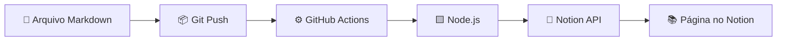

# 📚 GitHub → Notion Knowledge Sync

<p align="center">
  <strong>Sincronize automaticamente seus arquivos Markdown do GitHub com o Notion.</strong>
  <br />
  <sub>GitHub como fonte de verdade. Notion como uma interface bonita para estudar, consultar e organizar seus conhecimentos.</sub>
</p>

<p align="center">


</p>

---

## ✨ Sobre o projeto

Este projeto transforma uma estrutura de arquivos e pastas **Markdown (`.md`) armazenada no GitHub** em uma estrutura organizada de páginas no **Notion**.

A ideia é simples:

```text
GitHub
│
├── React/
│   ├── hooks/
│   │   ├── useState.md
│   │   └── useEffect.md
│   └── componentes.md
│
├── JavaScript/
│   └── promises.md
│
└── Git/
    └── branches.md
```

automaticamente se transforma em:

```text
📚 Base de Conhecimento
│
├── 📁 React
│   ├── 📁 hooks
│   │   ├── 📄 useState
│   │   └── 📄 useEffect
│   └── 📄 componentes
│
├── 📁 JavaScript
│   └── 📄 promises
│
└── 📁 Git
    └── 📄 branches
```

Tudo isso acontece automaticamente através do **GitHub Actions**.

---

## 🚀 Como funciona?



O fluxo é:

1. Você cria ou altera um `.md`.
2. Faz `git push`.
3. O GitHub Actions inicia automaticamente.
4. O script Node.js analisa a estrutura do diretório.
5. Pastas são transformadas em páginas do Notion.
6. Arquivos `.md` são transformados em documentos.
7. Documentos existentes são atualizados.
8. O conteúdo Markdown mantém sua formatação.

---

## 🎯 Objetivo

O projeto foi criado para manter **uma única fonte de verdade** para toda a documentação.

### GitHub

Ideal para:

* Versionamento
* Histórico de alterações
* Git
* Markdown
* Pull Requests
* Desenvolvimento

### Notion

Ideal para:

* Consulta rápida
* Organização visual
* Navegação
* Estudos
* Database
* Anotações
* Interface mais amigável

Assim:

> **GitHub armazena e versiona. Notion organiza e apresenta.**

---

## ✨ Recursos

| Recurso                            | Status |
| ---------------------------------- | :----: |
| 📁 Sincronização de pastas         |    ✅   |
| 📄 Sincronização de arquivos `.md` |    ✅   |
| 🔄 Atualização automática          |    ✅   |
| ⚙️ GitHub Actions                  |    ✅   |
| 🟨 Node.js                         |    ✅   |
| 🔗 Notion API                      |    ✅   |
| 📝 Headings                        |    ✅   |
| 📋 Listas                          |    ✅   |
| ☑️ Checklists                      |    ✅   |
| 💻 Blocos de código                |    ✅   |
| 🔗 Links                           |    ✅   |
| 📊 Tabelas                         |    ✅   |
| 💡 Callouts                        |    ✅   |
| 🖼️ Imagens                        |    ✅   |
| 📐 Equações                        |    ✅   |
| 🏷️ Organização por diretórios     |    ✅   |
| 🔙 Link para o GitHub              |   🔜   |
| 🗑️ Sincronização de exclusões     |   🔜   |
| ✏️ Sincronização de renomeações    |   🔜   |

---

## 🎨 Markdown rico

Os documentos podem continuar sendo escritos normalmente em Markdown.

Por exemplo:

````md
# useState

> Hook utilizado para adicionar estado a componentes React.

## Sintaxe

```jsx
const [state, setState] = useState(initialState);
````

## Características

* Simples
* Reativo
* Fácil de utilizar

## Exemplo

```jsx
import { useState } from "react";

function Counter() {
  const [count, setCount] = useState(0);

  return (
    <button onClick={() => setCount(count + 1)}>
      {count}
    </button>
  );
}
```

````

No Notion, o conteúdo aparece como uma página estruturada e formatada, sem precisar copiar e colar manualmente.

---

## 🗂️ Estrutura do projeto

```text
.
├── .github/
│   └── workflows/
│       └── notion-sync.yml
│
├── docs/
│   ├── React/
│   │   ├── hooks/
│   │   │   ├── useState.md
│   │   │   └── useEffect.md
│   │   │
│   │   └── componentes.md
│   │
│   ├── JavaScript/
│   │   ├── promises.md
│   │   └── async-await.md
│   │
│   └── Git/
│       └── branches.md
│
├── scripts/
│   └── sync-notion.js
│
├── package.json
├── package-lock.json
└── README.md
````

---

## 🛠️ Tecnologias

<p align="center">


</p>

### Stack

* **Node.js** — execução do sincronizador
* **GitHub Actions** — automação do workflow
* **Notion API** — criação e atualização das páginas
* **Markdown** — formato dos documentos
* **GitHub** — versionamento e armazenamento

---

## ⚙️ Configuração

### 1. Clone o repositório

```bash
git clone https://github.com/SEU_USUARIO/SEU_REPOSITORIO.git

cd SEU_REPOSITORIO
```

### 2. Instale as dependências

```bash
npm install
```

### 3. Configure a integração do Notion

Crie uma integração no Notion e obtenha seu token.

Depois compartilhe a página que será utilizada como raiz da documentação com essa integração.

### 4. Configure os Secrets

No GitHub:

```text
Settings
└── Secrets and variables
    └── Actions
```

Crie:

```text
NOTION_TOKEN
NOTION_PARENT_ID
```

### 5. Faça o primeiro push

```bash
git add .

git commit -m "Configure Notion synchronization"

git push
```

O GitHub Actions executará automaticamente a sincronização.

---

## 🔐 Segurança

O token do Notion **não deve ser colocado no código-fonte**.

Utilize os GitHub Actions Secrets:

```yaml
env:
  NOTION_TOKEN: ${{ secrets.NOTION_TOKEN }}
  NOTION_PARENT_ID: ${{ secrets.NOTION_PARENT_ID }}
```

Dessa forma, credenciais sensíveis permanecem fora do repositório.

---

## 📌 Convenção de documentos

A pasta `docs/` funciona como a raiz da base de conhecimento.

### Pasta

```text
docs/React/
```

vira:

```text
📁 React
```

### Subpasta

```text
docs/React/hooks/
```

vira:

```text
📁 React
└── 📁 hooks
```

### Markdown

```text
docs/React/hooks/useState.md
```

vira:

```text
📁 React
└── 📁 hooks
    └── 📄 useState
```

Essa estrutura permite organizar uma grande quantidade de documentação sem precisar cadastrar páginas manualmente.

---

## 🔄 Sincronização

Sempre que houver um `push` na branch principal:

```text
git push
    │
    ▼
GitHub Actions
    │
    ▼
sync-notion.js
    │
    ▼
Notion API
    │
    ▼
Notion atualizado
```

Também é possível executar o workflow manualmente pelo GitHub Actions através do:

```text
Run workflow
```

---

## 🧠 Filosofia do projeto

A principal ideia deste projeto é evitar depender exclusivamente de uma ferramenta para armazenar conhecimento.

### GitHub é a fonte de verdade

Os arquivos:

```text
.md
```

são os documentos originais.

Eles possuem:

* histórico
* versionamento
* commits
* branches
* pull requests
* backup

### Notion é a camada de apresentação

O Notion oferece:

* navegação visual
* páginas
* organização
* busca
* filtros
* interface agradável

Isso cria uma separação clara entre:

```text
📦 Dados
   ↓
GitHub
   ↓
⚙️ Automação
   ↓
🎨 Interface
   ↓
Notion
```

---

## 🛣️ Roadmap

### ✅ Concluído

* [x] Integração com Notion API
* [x] GitHub Actions
* [x] Leitura recursiva de diretórios
* [x] Criação automática de páginas
* [x] Atualização automática de documentos
* [x] Suporte a Markdown rico

### 🚧 Próximos passos

* [ ] Detectar arquivos removidos
* [ ] Arquivar páginas removidas
* [ ] Detectar arquivos renomeados
* [ ] Detectar pastas renomeadas
* [ ] Adicionar link automático para o GitHub
* [ ] Adicionar metadados às páginas
* [ ] Melhorar tratamento de erros
* [ ] Logs mais detalhados
* [ ] Cache de páginas do Notion
* [ ] Sincronização incremental
* [ ] Testes automatizados

---

## 📊 Exemplo de resultado

### GitHub

```text
docs/
├── Frontend/
│   ├── React/
│   │   ├── hooks.md
│   │   └── components.md
│   └── CSS/
│       └── flexbox.md
│
└── Backend/
    ├── Node.js/
    │   └── express.md
    └── SQL/
        └── joins.md
```

### Notion

```text
📚 Base de Conhecimento

├── 📁 Frontend
│   │
│   ├── 📁 React
│   │   ├── 📄 hooks
│   │   └── 📄 components
│   │
│   └── 📁 CSS
│       └── 📄 flexbox
│
└── 📁 Backend
    │
    ├── 📁 Node.js
    │   └── 📄 express
    │
    └── 📁 SQL
        └── 📄 joins
```

---

## 🤝 Contribuindo

Contribuições são bem-vindas!

Se encontrar um problema ou tiver uma ideia para melhorar o projeto, abra uma **Issue**.

Para contribuir com código:

```bash
git fork
git clone
git checkout -b feature/minha-feature
git commit -m "feat: minha feature"
git push
```

Depois abra um **Pull Request**.

---

## 📄 Licença

Este projeto está disponível sob a licença definida no arquivo [`LICENSE`](LICENSE).

---

<p align="center">
  Desenvolvido com 💻, Markdown e ☕
</p>

<p align="center">
  <sub>GitHub → GitHub Actions → Node.js → Notion</sub>
</p>
