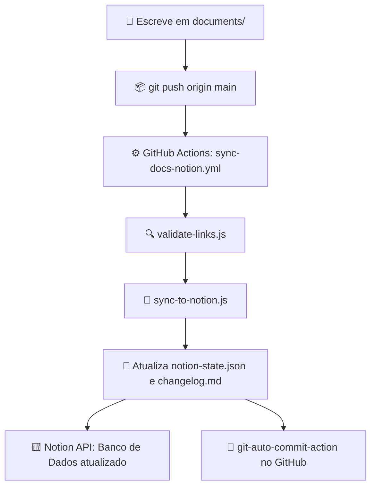

# 📚 Base de Conhecimento Multi-Projetos (GitHub ➔ Notion)

<p align="center">
  <strong>Sincronize automaticamente todas as suas anotações e documentações de projetos do GitHub para o Notion.</strong>
  <br />
  <sub>Todas as pastas e arquivos de documentação ficam organizados dentro da pasta <code>documents/</code>.</sub>
</p>

---

## 🏗️ Estrutura de Pastas e Organização

Todos os seus projetos e anotações devem ser criados dentro do diretório `documents/`. A estrutura de subpastas dentro de `documents/` define automaticamente a **Categoria** e **Subcategoria** na Wiki do Notion:

```text
.
├── 📁 documents/
│   ├── 📁 estudos/
│   │   └── 📁 react/
│   │       └── 📄 hooks.md              --> Categoria: estudos | Subcategoria: react
│   │
│   ├── 📁 projetos/
│   │   └── 📁 projeto-alpha/
│   │       ├── 📄 README.md             --> Categoria: projetos | Subcategoria: projeto-alpha | Tipo: README
│   │       └── 📄 arquitetura.md        --> Categoria: projetos | Subcategoria: projeto-alpha | Tipo: Documento
│   │
│   └── 📁 teste/
│       └── 📄 primeiro documento.md  --> Categoria: teste | Subcategoria: null | Tipo: Documento
│
├── 📄 changelog.md                  --> Categoria: Raiz | Tipo: Changelog (gerado automaticamente)
└── 📄 README.md                     --> Categoria: Raiz | Tipo: README
```

---

## 🔄 Fluxo de Funcionamento



---

## 🏷️ Propriedades no Notion

| Propriedade | Tipo | Descrição |
| :--- | :--- | :--- |
| **Nome** | Title | Nome do arquivo sem extensão |
| **Categoria** | Select | Primeira pasta dentro de `documents/` (ex: `projetos`, `estudos`, `teste`) |
| **Subcategoria** | Select | Subpastas internas dentro de `documents/` (ex: `projeto-alpha`, `react`) |
| **Tipo** | Select | `Documento`, `README` ou `Changelog` |
| **Github Path** | Text | Caminho relativo completo no repositório |
| **Github URL** | URL | Link direto para visualizar o arquivo no GitHub |
| **Última sincronização** | Date | Data e hora ISO da sincronização |

---

## 🛠️ Execução Local

```bash
# Validar links nas anotações
node scripts/validate-links.js

# Sincronizar com o Notion
node scripts/sync-to-notion.js

# Forçar sincronização completa (Ignorar Cache MD5)
FORCE_FULL_SYNC=true node scripts/sync-to-notion.js

# Limpeza total e recriação (Hard Rebase)
HARD_REBASE=true node scripts/sync-to-notion.js
```
