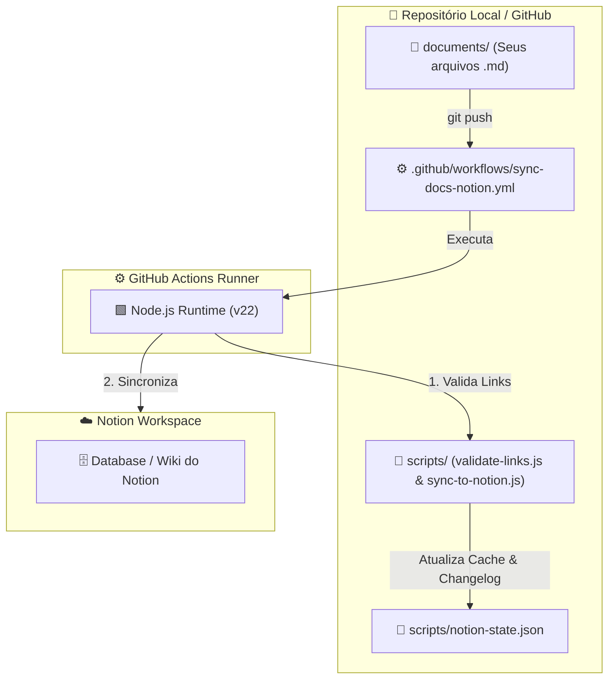

# 🧠 Visão Geral da Arquitetura & Conceitos Fundamentais

> **Módulo 1 do Guia Especialista em Engenharia de Software**  
> *Sincronização de Conhecimento GitHub ➔ Notion*

---

## 📌 Introdução e Filosofia do Projeto

No desenvolvimento de software moderno, um dos maiores desafios de equipes e desenvolvedores individuais é a **fragmentação da documentação**.

Muitas vezes, a documentação fica desatualizada porque existem duas forças opostas:
1. **Desenvolvedores preferem Markdown + Git**: Versionamento, histórico de commits, revisão por Pull Request, suporte a IDEs e código junto com os arquivos `.md`.
2. **Leitores/Stakeholders preferem o Notion**: Navegação visual amigável, busca rápida, banco de dados relacional, tabelas filtráveis e interface fluida.

### A Solução da Arquitetura

A arquitetura deste repositório estabelece uma **divisão estrita de responsabilidades**:

```text
┌─────────────────────────────────────────────────────────┐
│              GITHUB (Fonte Única da Verdade)            │
│  - Armazena os arquivos originais (.md)                 │
│  - Controla versão, histórico e branches                │
└────────────────────────────┬────────────────────────────┘
                             │
                             │ (GitHub Actions + Node.js)
                             ▼
┌─────────────────────────────────────────────────────────┐
│            NOTION (Camada Visual & Apresentação)        │
│  - Apresenta as páginas formatadas                      │
│  - Organiza por categorias, busca e navegação rápida    │
└─────────────────────────────────────────────────────────┘
```

---

## 🏗️ Visão Geral dos Componentes

O projeto é composto por 4 pilares principais:



---

## 📐 Estrutura de Pastas e Convenção de Categorização

Toda a documentação deve residir dentro do diretório `documents/`. O caminho relativo de cada pasta é convertido automaticamente nas propriedades **Categoria** e **Subcategoria** da Wiki do Notion:

```text
documents/
├── 📁 engenharia/
│   └── 📁 arquitetura/
│       └── 📄 microsservicos.md     --> Categoria: engenharia | Subcategoria: arquitetura
│
├── 📁 estudos/
│   └── 📁 react/
│       └── 📄 hooks.md              --> Categoria: estudos    | Subcategoria: react
│
└── 📁 github | docs/
    └── 📄 01-visao-geral.md          --> Categoria: github | docs | Subcategoria: null
```

---

## 🔑 Mapeamento de Propriedades no Banco de Dados do Notion

Cada arquivo `.md` é transformado em uma página dentro do Banco de Dados do Notion com a seguinte estrutura de esquema (Database Schema):

| Nome da Propriedade no Notion | Tipo no Notion | Origem dos Dados no Script |
| :--- | :--- | :--- |
| **Nome** | `title` | Nome do arquivo `.md` sem extensão |
| **Categoria** | `select` | Primeira pasta dentro de `documents/` (ex: `github \| docs`) |
| **Subcategoria** | `select` | Subpastas subsequentes dentro de `documents/` (se houver) |
| **Tipo** | `select` | `README`, `Changelog` ou `Documento` |
| **Github Path** | `rich_text` | Caminho relativo exato do arquivo no repositório |
| **Github URL** | `url` | Link direto para visualizar o arquivo no GitHub |
| **Última sincronização** | `date` | Data e hora ISO do momento do sync |

---

## 🎯 Próximos Módulos

Nesta série de documentos técnicos, exploraremos cada detalhe do código:

1. **[Módulo 1: Visão Geral e Arquitetura](./01-visao-geral-arquitetura.md)** *(Este documento)*
2. **[Módulo 2: GitHub Actions e Workflows](./02-github-actions-workflows.md)**
3. **[Módulo 3: Validação de Links (`validate-links.js`)](./03-script-validacao-links.md)**
4. **[Módulo 4: Mecanismo de Sincronização (`sync-to-notion.js`)](./04-script-sincronizacao-notion.md)**
5. **[Módulo 5: Guia de Replicação do Zero](./05-guia-passo-a-passo-replicacao.md)**
