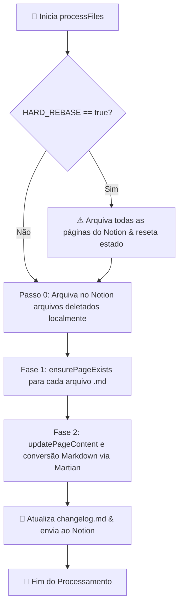

# 🚀 Sincronização Notion: `scripts/sync-to-notion.js`

> **Módulo 4 do Guia Especialista em Engenharia de Software**  
> *Análise Detalhada do Core Engine de Sincronização*

---

## 📌 Visão Geral do Mecanismo

O script [`scripts/sync-to-notion.js`](../../scripts/sync-to-notion.js) é o coração técnico do projeto. Ele se conecta à API oficial do Notion através do cliente `@notionhq/client` e transforma documentos Markdown em páginas visuais completas.



---

## 🔬 Conceitos Técnicos Avançados Implementados

### 1. Conversão AST Markdown ➔ Notion Blocks (`@tryfabric/martian`)
O Notion não salva texto puro ou HTML bruto; ele salva uma árvore de objetos de blocos JSON.  
Utilizamos o módulo `@tryfabric/martian` (`markdownToBlocks`) para traduzir a sintaxe Markdown em blocos nativos:

```javascript
let blocks = markdownToBlocks(markdownBody);
blocks = flattenDeepBlocks(blocks, 0);
```

#### Aprofundamento da Árvore: `flattenDeepBlocks`
A API do Notion limita a profundidade de aninhamento de blocos a no máximo 2 níveis (ex: uma lista dentro de um toggle dentro de um callout). Se a árvore for mais funda, a API lança erro. A função `flattenDeepBlocks` achata recursivamente os blocos que ultrapassam a profundidade máxima:

```javascript
function flattenDeepBlocks(blocks, currentDepth = 0) {
  let flattened = [];
  for (const block of blocks) {
    let children = null;
    const type = block.type;
    if (block[type] && block[type].children) {
      children = block[type].children;
      if (currentDepth >= 2) delete block[type].children;
    }
    flattened.push(block);
    if (children && children.length > 0) {
      if (currentDepth >= 2) {
        flattened.push(...flattenDeepBlocks(children, currentDepth));
      } else {
        block[type].children = flattenDeepBlocks(children, currentDepth + 1);
      }
    }
  }
  return flattened;
}
```

---

### 2. A Técnica do `synced_block` para Exclusão Instantânea (High-Speed Cleanup)
Quando atualizamos uma página existente no Notion, precisamos apagar o conteúdo antigo antes de escrever o novo.

**O Problema**: Se uma página tiver 200 blocos (parágrafos, imagens, códigos), apagar bloco por bloco faz 200 chamadas de API, levando cerca de 40 a 60 segundos por página.  
**A Solução Inteligente**: Embrulhamos todo o conteúdo da página dentro de um único bloco container do tipo **`synced_block`**:

```javascript
// Criamos um synced_block raiz na página
const wrapperResponse = await notion.blocks.children.append({
  block_id: notionPageId,
  children: [
    {
      object: 'block',
      type: 'synced_block',
      synced_block: { synced_from: null, children: [] }
    }
  ]
});

const containerId = wrapperResponse.results[0].id;

// Injetamos todos os blocos em lotes (chunks) de 100 dentro do containerId
const blockChunks = chunkArray(blocks, 100);
for (const chunk of blockChunks) {
  await notion.blocks.children.append({
    block_id: containerId,
    children: chunk
  });
}
```

**Resultado**: Nas futuras atualizações, a função `clearPageContent` precisa apagar **apenas esse 1 bloco raiz**! A exclusão que levava 1 minuto passa a ser feita em **menos de 500ms**!

---

### 3. Cache e Sincronização Incremental com Hashes MD5
Para economizar chamadas de API e tempo de execução, mantemos o arquivo `scripts/notion-state.json`:

```json
{
  "files": {
    "documents/estudos/react/hooks.md": "3bbe9806-50d5-8142-960a-fa2ec1181473"
  },
  "hashes": {
    "documents/estudos/react/hooks.md": "d082aff8156998b4ba6df6fbc7f9779c"
  }
}
```

A cada execução, o script calcula o MD5 hash do conteúdo do arquivo com o pacote nativo `crypto`:

```javascript
function getHash(content) {
  return crypto.createHash('md5').update(content).digest('hex');
}
```

Se `state.hashes[relativePath] === currentHash`, o arquivo não sofreu edições e o script exibe `[PULANDO]`, ignorando o envio de rede.

---

### 4. Tradução Automática de Links Relativos para URLs do Notion
Se você colocar um link no seu Markdown apontando para outro documento do repositório:
```markdown
Veja mais informações no [Guia de Hooks](../../estudos/react/hooks.md).
```

O script intercepta essa string por Regex durante o sync, localiza o ID da página `hooks.md` salva no `notion-state.json` e substitui o link automaticamente por:
```markdown
Veja mais informações no [Guia de Hooks](https://notion.so/3bbe980650d58142960afa2ec1181473).
```
Dessa forma, os links funcionam nativamente dentro do próprio aplicativo do Notion!

---

### 5. Changelog Automatizado (`changelog.md`)
O script rastreia os arquivos criados (🟢), atualizados (🟡) e deletados (🔴) durante a sessão e gera entradas estruturadas no arquivo `changelog.md`, enviando a cópia atualizada para a própria página de Changelog no Notion:

```markdown
## Sincronização: 2026-08-13 11:27:04 (UTC)

### 🟢 Arquivos Criados
- `documents/estudos/react/hooks.md`

### 🔴 Arquivos Deletados
- `documents/teste/old.md`
```
