# 🍎 Teacher Up & Assistent (IA Generativa para Planejamento Pedagógico)

> **Documentação de Estudo & Engenharia Reversa do Projeto**  
> *Localização original do código-fonte: `/home/desenvolvedores/programa/projeto-iagenerativa-palloma`*

---

## 📌 Visão Geral do Projeto

O **Teacher Up & Assistent** é uma aplicação web SPA (*Single Page Application*) desenvolvida em **React 19 + Vite**, concebida para transformar radicalmente a rotina de planejamento de aulas da professora **Palloma Favarão** (Língua Portuguesa) no SESI Vinhedo.

A aplicação atua como um copiloto pedagógico inteligente, integrando diretamente o modelo **Google Gemini** (`gemini-2.5-flash`) via API REST para automatizar duas tarefas essenciais:
1. **Geração Automatizada de Planos de Aula Completos**: Estruturação didática com Habilidades da BNCC, Objetivos, Metodologias Ativas, Cronograma (*Timeboxing*), Exercícios Práticos com Gabarito e Dicas de Inclusão/Adaptação para alunos com NEE (*Necessidades Educativas Especiais*).
2. **Consulta Dinâmica às Expectativas da BNCC**: Consulta e extração em tempo real de códigos e competências por série (do 6º ano do Ensino Fundamental ao 3º ano do Ensino Médio).
3. **Exportação Imediata**: Cópia instantânea para a Área de Transferência e exportação de PDF formatado para impressão rápida.

---

## 🧭 Metáfora do Mundo Real (A Analogia da Cozinha Profissional)

Imagine um restaurante de alta gastronomia onde um chef de cozinha precisa preparar banquetes diários para centenas de clientes com gostos e restrições alimentares diferentes.

* **O Tema, Série e Duração** são a *comanda do cliente* (ex: "Jantar para 30 pessoas com restrição a lactose em 50 minutos").
* **A BNCC (Base Nacional Comum Curricular)** é o *manual sanitário e nutricional oficial* que estabelece quais nutrientes cada prato obrigatoriamente deve conter.
* **O Teacher Up & Assistent (com Gemini)** é o *Sous-Chef Mágico*: você entrega a comanda básica e, em segundos, ele não só cria a receita completa com os ingredientes exatos, mas divide os tempos de preparo (15% entrada, 60% prato principal, 25% sobremesa), sugere decorações criativas, fornece o guia de degustação (gabarito) e ainda indica como adaptar o prato para quem tem alergias.
* **O Botão de PDF e Copiar** é a *esteira de entrega*, pronta para colocar a receita impressa direto na bancada da aula.

---

## 🛠️ Stack Tecnológica

| Tecnologia | Versão / Tipo | Papel no Projeto |
| :--- | :--- | :--- |
| **React** | `^19.2.0` | Biblioteca de interface declarativa com componentes funcionais e hooks reativos |
| **Vite** | `^7.2.4` | Bundler e servidor de desenvolvimento ultraotimizado com Hot Module Replacement (HMR) |
| **React Router DOM** | `^7.10.0` | Roteamento cliente desacoplado (`BrowserRouter`, `Routes`, `Route`, `Link`, `useNavigate`) |
| **Google Gemini API** | `gemini-2.5-flash` | Motor de inteligência artificial generativa consumido via endpoints REST HTTP |
| **Lucide React & FontAwesome** | `0.555.0` / `6.5.1` | Iconografia vetorial rica para ações de UI, feedback e estados visuais |
| **CSS3 Custom Layouts** | Vanilla Moderno | Glassmorphism (`backdrop-filter`), formas geométricas flutuantes e text-stroke via multi-shadow |

---

## 📥 Entradas e Saídas do Sistema

```mermaid
flowchart LR
    subgraph ENTRADA["📥 Entradas (Inputs)"]
        E1["Tema da Aula (Texto / Chips)"]
        E2["Série/Ano (6º ao 3º EM)"]
        E3["Duração (30m a 2h)"]
        E4["Observações de Turma/Inclusão"]
        E5["Credenciais de Login (palloma / 1234)"]
    end

    subgraph PROCESSAMENTO["⚙️ Processamento"]
        P1["Motor React 19 + Prompt Engineering"]
        P2["Google Gemini 2.5 Flash API"]
        P3["Custom Markdown & JSON Parser"]
    end

    subgraph SAIDA["📤 Saídas (Outputs)"]
        S1["Plano de Aula Estruturado"]
        S2["Cartões de Habilidades BNCC"]
        S3["Impressão PDF Formatada"]
        S4["Cópia p/ Clipboard"]
    end

    ENTRADA --> PROCESSAMENTO --> SAIDA
```

---

## 📚 Sumário das Anotações de Estudo

Esta documentação detalha a arquitetura, segredos de código e dissecção técnica de cada camada:

1. **[00-introducao.md](./00-introducao.md)** *(Este arquivo)* — Panorama geral, analogia do mundo real e mapa de estudo.
2. **[01-arquitetura-e-fluxo-dados.md](./01-arquitetura-e-fluxo-dados.md)** — Arquitetura de componentes, ciclo de vida das requisições e diagramas de sequência da IA e da BNCC.
3. **[02-radar-codigos-incomuns-e-hacks.md](./02-radar-codigos-incomuns-e-hacks.md)** — Análise técnica minuciosa dos 5 códigos incomuns, soluções fora da curva e otimizações presentes no projeto.
4. **[03-disseccao-assistente-ia-e-gemini.md](./03-disseccao-assistente-ia-e-gemini.md)** — Dissecção profunda e comentada linha a linha de `AssistenteIA.jsx` e `AssistenteIA.css`.
5. **[04-disseccao-expectativas-bncc.md](./04-disseccao-expectativas-bncc.md)** — Engenharia de prompts com JSON estrito, regex extractor e renderização condicional em `Expectativas.jsx`.
6. **[05-disseccao-login-home-sobrenos.md](./05-disseccao-login-home-sobrenos.md)** — Dissecção dos fluxos de autenticação mockada, glassmorphism e montagem dos cards da equipe.
7. **[06-glossario-didatico-universal.md](./06-glossario-didatico-universal.md)** — Dicionário de termos técnicos, conceitos de IA e padrões de desenvolvimento.
