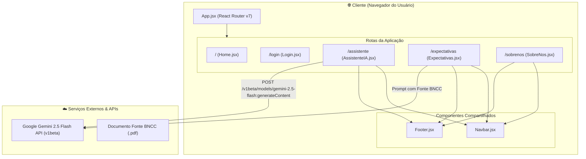
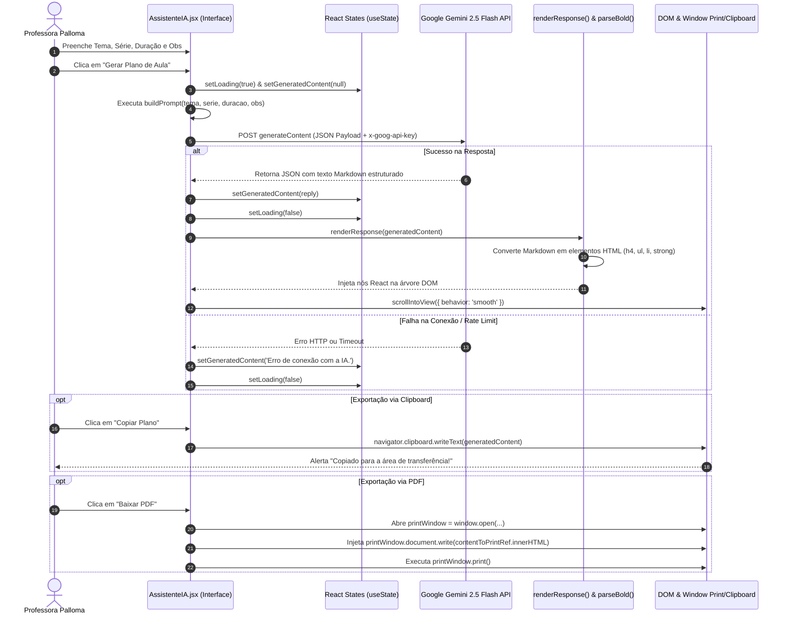
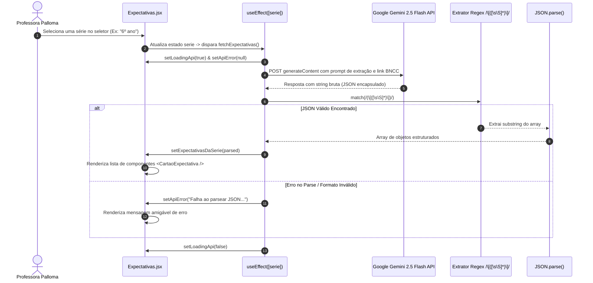

# 🗺️ Arquitetura & Fluxo Completo de Dados

> **Documentação Técnica do Projeto Teacher Up & Assistent**  
> *Módulo de Arquitetura de Software e Ciclo de Vida das Requisições*

---

## 📌 Visão Arquitetural

O projeto adota uma arquitetura **Single Page Application (SPA)** desacoplada, utilizando **React 19** no Front-End e comunicando-se diretamente com os serviços em nuvem da **Google Generative Language API (Gemini 2.5 Flash)** via requisições HTTP RESTful (`fetch`).

---

## 🔄 Fluxo de Ciclo de Vida do Assistente de IA

O fluxo de geração de planos de aula em `AssistenteIA.jsx` segue uma sequência precisa desde o input do usuário até a renderização visual e opções de exportação:

---

## 🔄 Fluxo de Consulta de Expectativas da BNCC

Em `Expectativas.jsx`, a interação do usuário com o `select` dispara automaticamente uma requisição orientada a extração estrita de JSON:

---

## 🔒 Gestão de Variáveis de Ambiente e Segurança

O projeto utiliza o sistema de variáveis de ambiente do **Vite**:
* `import.meta.env.VITE_GEMINI_KEY`: Injetada em tempo de build/execução para autenticar as chamadas à API Gemini.
* Cabeçalho de autorização: `x-goog-api-key`.

> [!WARNING]
> Em aplicações React Client-Side (SPA), chaves prefixadas com `VITE_` são embutidas no bundle JavaScript final do cliente. Em ambientes produtivos de larga escala corporativa, a melhor prática é criar um proxy de Backend (Node.js/Express) para proteger a chave e aplicar rate limiting.
