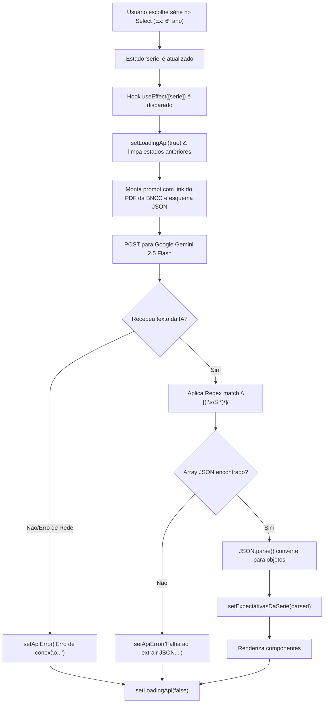

# 🔬 Dissecção Técnica: Expectativas da BNCC & Extração Estruturada

> **Documentação de Engenharia Reversa do Projeto Teacher Up & Assistent**  
> *Análise Detalhada Linha por Linha de `Frontend/src/pages/Expectativas.jsx` e `Expectativas.css`*

---

## 📌 Responsabilidade do Arquivo

O arquivo `Expectativas.jsx` implementa a central de consulta às diretrizes da **Base Nacional Comum Curricular (BNCC)**. Suas principais responsabilidades são:
1. **Seleção Reativa por Ano Escolar**: Permite que o professor filtre dinamicamente as competências do 6º ano do Fundamental até a 3ª série do Médio.
2. **Extração de Conhecimento Estruturado via LLM**: Utiliza a IA Generativa como um motor de extração semântica direcionado a um documento PDF de referência oficial da BNCC.
3. **Parseamento Resiliente de Dados em JSON**: Aplica regex para interceptar payloads JSON mesmo se a IA incluir texto conversacional ou markdown circundante.
4. **Renderização Modular por Cartões (`CartaoExpectativa`)**: Exibe o código alfanumérico oficial da BNCC (ex: `EF06LP01`), a prática de linguagem, a descrição da habilidade e os objetivos pedagógicos.
5. **Máquina de Estados Visuais Completos**: Gerencia 5 estados de interface (Sem Seleção, Carregando/Buscando, Erro de API/Conexão, Lista Vazia e Lista de Cartões Populada).

---

## 💻 Código-Fonte Integralmente Comentado

Abaixo está o código completo de `Expectativas.jsx` com notas explicativas detalhadas:

```javascript
import React, { useState, useEffect } from "react";
// useState: gerencia série selecionada, array de expectativas e estados de rede
// useEffect: dispara a requisição à IA automaticamente sempre que o estado 'serie' se altera

import "./styles/Expectativas.css"; // Estilização visual com destaque para o código BNCC
import Navbar from "../components/Navbar.jsx"; // Barra de navegação reutilizável
import Footer from "../components/Footer.jsx"; // Rodapé reutilizável

// --- Subcomponente Modular: Cartão Individual de Expectativa BNCC ---
const CartaoExpectativa = ({ expectativa }) => (
  <section className="item-expectativa">
    <h4>
      {/* Código alfanumérico BNCC em destaque rosa (ex: EF06LP01) */}
      <span className="codigo-bncc">{expectativa.codigo || "N/A"}</span>
      {/* Prática de Linguagem (ex: Leitura, Produção de Texto, Oralidade) */}
      <span className="area-pratica"> - {expectativa.praticas || "Prática Indefinida"}</span>
    </h4>
    {/* Descrição detalhada da habilidade */}
    <p className="texto-habilidade">
      <strong>Habilidade:</strong> {expectativa.habilidades || "Sem descrição de habilidade."}
    </p>
    {/* Objetivos: suporta array de strings ou texto direto */}
    <p className="texto-objetivo">
      <strong>Objetivos:</strong> {Array.isArray(expectativa.objetivos) ? expectativa.objetivos.join(", ") : expectativa.objetivos || "N/A"}
    </p>
  </section>
);

// --- Componente Principal da Página ---
export default function Expectativas() {
  // 1. Estados locais de controle
  const [serie, setSerie] = useState(""); // Inicia vazio para forçar escolha explícita do usuário
  const [expectativasDaSerie, setExpectativasDaSerie] = useState([]); // Array com objetos parseados
  const [loadingApi, setLoadingApi] = useState(false); // Flag de loading
  const [apiError, setApiError] = useState(null); // Armazena mensagens de erro para o usuário

  // 2. Coleção de anos escolares disponíveis
  const seriesDisponiveis = [
    "6º ano",
    "7º ano",
    "8º ano",
    "9º ano",
    "1º ano Ensino Médio",
    "2º ano Ensino Médio",
    "3º ano Ensino Médio",
  ];

  // 3. Efeito colateral reativo disparado pela alteração do seletor 'serie'
  useEffect(() => {
    // Se o usuário selecionou a opção vazia ("Selecione"), limpa a lista e encerra
    if (!serie) {
      setExpectativasDaSerie([]);
      return;
    }

    const fetchExpectativas = async (serieSelecionada) => {
      setLoadingApi(true);
      setApiError(null);
      setExpectativasDaSerie([]);

      const API_KEY = import.meta.env.VITE_GEMINI_KEY;
      const MODEL = "gemini-2.5-flash";

      // Prompt especializado com link direto da BNCC e restrição estrita de retorno JSON
      const prompt = `Você é um assistente que extrai, a partir do documento da BNCC (link abaixo), as EXPECTATIVAS/objetivos de aprendizagem correspondentes à série informada. Retorne SOMENTE um JSON válido — um array de objetos — onde cada objeto possui as chaves: "codigo", "praticas", "habilidades", "objetivos" (objetivos pode ser um array de strings ou uma string). NÃO inclua texto adicional fora do JSON. Use o link como fonte:
https://www.alex.pro.br/BNCC%20L%C3%ADngua%20Portuguesa.pdf

Série solicitada: ${serieSelecionada}

Exemplo de saída esperada (JSON):
[
  {"codigo":"EF06LP01","praticas":"Leitura","habilidades":"Ler...","objetivos":["Identificar..."]},
  ...
]
`;

      try {
        const resp = await fetch(
          `https://generativelanguage.googleapis.com/v1beta/models/${MODEL}:generateContent`,
          {
            method: "POST",
            headers: {
              "Content-Type": "application/json",
              "x-goog-api-key": API_KEY,
            },
            body: JSON.stringify({
              contents: [{ parts: [{ text: prompt }] }],
            }),
          }
        );

        const data = await resp.json();
        const raw = data?.candidates?.[0]?.content?.parts?.[0]?.text || "";

        // --- Estratégia de Captura Resiliente de JSON ---
        // Localiza a primeira ocorrência de '[' até a última ocorrência de ']'
        // ignorando blocos como ```json ou textos introdutórios/conclusivos
        const match = raw.match(/(\[([\s\S]*)\])/);
        if (match && match[1]) {
          try {
            const parsed = JSON.parse(match[1]);
            if (Array.isArray(parsed)) {
              setExpectativasDaSerie(parsed);
            } else {
              setApiError("Resposta não é um array JSON válido.");
            }
          } catch (err) {
            console.error('Erro ao parsear JSON da resposta da IA:', err);
            setApiError("Falha ao parsear JSON retornado pela API.");
          }
        } else {
          setApiError("Não foi possível extrair JSON válido da resposta da API.");
        }
      } catch (e) {
        console.error(e);
        setApiError("Erro de conexão com a API.");
      } finally {
        setLoadingApi(false);
      }
    };

    fetchExpectativas(serie);
  }, [serie]); // Dependência: executa sempre que a série mudar

  return (
    <section className="container-pagina-expectativas">
      <Navbar />

      {/* Formas decorativas no fundo com z-index zero */}
      <section className="forma-decorativa forma-circulo forma-amarela-topo" />
      <section className="forma-decorativa forma-circulo forma-azul-topo-direito" />
      <section className="forma-decorativa forma-verde-meio" />
      <section className="forma-decorativa forma-circulo forma-vermelha-pequena-meio" />
      <section className="forma-decorativa forma-circulo forma-amarela-grande-inferior" />

      <section className="conteudo-pagina-expectativas">
        <section className="cabecalho-expectativas">
          <h1 className="titulo-principal-expectativas">Veja a lista de<br/>expectativas</h1>
        </section>

        {/* Seletor de Série / Ano */}
        <section className="seletor-serie-expectativas">
          <label htmlFor="select-serie-expectativas">Selecione a Série / Ano:</label>
          <br />
          <select
            id="select-serie-expectativas"
            value={serie}
            onChange={(e) => setSerie(e.target.value)}
          >
            <option value=""> Selecione</option>
            {seriesDisponiveis.map((s) => (
              <option key={s} value={s}>{s}</option>
            ))}
          </select>
        </section>

        {/* Container Principal de Cartões */}
        <section className="area-cartoes-expectativas">
          <h2 className="titulo-cartao-expectativas">Expectativas - {serie || "(nenhuma selecionada)"}</h2>

          {/* Máquina de Estados da Interface */}
          
          {/* ESTADO 1: Nenhuma série selecionada */}
          {serie === "" ? (
            <section className="area-vazia-expectativas">
              <section className="icone-placeholder-expectativas">
                <i className="fa-solid fa-hand-point-up" aria-hidden="true"></i>
              </section>
              <p className="texto-vazio-negrito-expectativas">Selecione uma Série / Ano acima para ver as expectativas.</p>
              <span className="texto-vazio-pequeno-expectativas">Escolha a Série e a lista aparecerá aqui.</span>
            </section>
          ) : 
          /* ESTADO 2: Carregando dados da IA */
          loadingApi ? (
            <section className="area-vazia-expectativas">
              <section className="icone-placeholder-expectativas">
                <i className="fa-solid fa-spinner fa-spin" aria-hidden="true"></i>
              </section>
              <p className="texto-vazio-negrito-expectativas">Buscando expectativas para {serie}...</p>
              <span className="texto-vazio-pequeno-expectativas">Aguarde enquanto consultamos a fonte BNCC.</span>
            </section>
          ) : 
          /* ESTADO 3: Erro de API ou Falha no Parse */
          apiError ? (
            <section className="area-vazia-expectativas">
              <section className="icone-placeholder-expectativas">
                <i className="fa-solid fa-triangle-exclamation" aria-hidden="true"></i>
              </section>
              <p className="texto-vazio-negrito-expectativas">Erro: {apiError}</p>
              <span className="texto-vazio-pequeno-expectativas">Tente novamente ou verifique sua conexão/API.</span>
            </section>
          ) : 
          /* ESTADO 4: Retorno com array vazio */
          expectativasDaSerie.length === 0 ? (
            <section className="area-vazia-expectativas">
              <section className="icone-placeholder-expectativas">
                <i className="fa-solid fa-wand-magic-sparkles" aria-hidden="true"></i>
              </section>
              <p className="texto-vazio-negrito-expectativas">Não há expectativas cadastradas para o {serie}.</p>
              <span className="texto-vazio-pequeno-expectativas">Verifique o arquivo de dados ou selecione outra série.</span>
            </section>
          ) : 
          /* ESTADO 5: Lista de cartões renderizada com sucesso */
          (
            <section className="lista-expectativas">
              {expectativasDaSerie.map((exp, idx) => (
                <CartaoExpectativa key={idx} expectativa={exp} />
              ))}
            </section>
          )}
        </section>

        <Footer />
      </section>
    </section>
  );
}
```

---

## 🔍 Detalhamento do Fluxo Operacional


