# 🥑 Projeto Gratidão (Plataforma Full Stack Web de Mensagens & Histórias Inspiradoras)

> **Documentação de Estudo & Engenharia Reversa do Projeto**  
> *Localização original do código-fonte: `/home/desenvolvedores/programa/projeto-gratidao`*

---

## 📌 Visão Geral do Projeto

O **Projeto Gratidão** é uma aplicação web Full Stack desenvolvida em **Node.js, Express, Microsoft SQL Server, HTML5, CSS3 e JavaScript Vanilla**. O sistema nasceu de uma proposta interdisciplinar entre o curso de Desenvolvimento de Sistemas (**SENAI**) e a disciplina de Língua Inglesa (**SESI**), conduzido sob a orientação dos professores **Antônio Tupinambá**, **Leandro Grosso** e **Flávia Viana**.

O objetivo principal da aplicação é proporcionar uma experiência digital interativa em torno da temática da **Gratidão e do Dia de Ação de Graças (*Thanksgiving Day*)**, permitindo que os usuários não apenas leiam e reflitam sobre mensagens e histórias motivacionais, mas também compartilhem seus próprios relatos e frases de agradecimento.

### Módulos Principais do Sistema:
1. 🌾 **Portal Conceitual e Cultural**: Páginas ricas sobre as diferentes facetas da gratidão (Passiva, Ativa e Teórica) e a história do Dia de Ação de Graças (*Thanksgiving*).
2. 🎲 **Gerador de Mensagens Aleatórias de Gratidão**: Endpoint REST que sorteia de forma pseudo-aleatória nativa frases categorizadas por temas (Saúde, Família, Fé, Amigos, Vida).
3. 📖 **Mecanismo de Pesquisa de Histórias Inspiradoras**: Motor de busca por palavras-chave com exibição de relatos de superação e imagens associadas.
4. ✍️ **Criação de Conteúdo (CRUD / POST)**: Formulários de submissão de novas mensagens e histórias integrados ao Microsoft SQL Server.
5. 🌐 **Módulo de Internacionalização Bilingue (i18n)**: Alternância instantânea de idioma (Português / Inglês) na página inicial.

---

## 🧭 Metáfora do Mundo Real: *O Mural Comunitário de Gratidão com Arquivo Central*

Imagine uma grande praça pública onde existe um mural de recados e uma biblioteca de histórias da comunidade:

* **O Backend Node.js/Express** é o *balcão de atendimento dos mensageiros*: ele recebe as cartas dos moradores, carimba, verifica se estão preenchidas e despacha para o cofre.
* **O Banco de Dados SQL Server** é o *grande cofre de arquivos*: guarda todas as cartas em gavetas separadas (a gaveta de `MensagensCurtas` e a gaveta de `HistoriasInspiradoras`).
* **A Rota de Mensagem Aleatória (`ORDER BY NEWID()`)** é a *urna da sorte*: o visitante chega, puxa uma alavanca e a urna sorteia na hora uma frase de inspiração para iluminar o dia.
* **O Buscador por Palavra-Chave** é o *índice da biblioteca*: o usuário diz uma palavra (ex: "professor", "mãe", "vida") e o arquivista traz todas as pastas que contêm aquela menção.
* **O Slider do Frontend e os Botões de Bandeira** são o *telão da praça com tradução simultânea*: alternam fotos da cidade e trocam os letreiros para inglês ou português com um toque.

---

## 🛠️ Stack Tecnológica

| Tecnologia | Versão / Tipo | Papel no Ecossistema |
| :--- | :--- | :--- |
| **Node.js** | Runtime JavaScript | Ambiente de execução do servidor backend assíncrono |
| **Express** | `^4.21.1` | Framework web para criação de rotas RESTful e middlewares |
| **Tedious** | `^18.6.1` | Driver puro em JavaScript para protocolo TDS (*Tabular Data Stream*) do Microsoft SQL Server |
| **CORS** | `^2.8.5` | Middleware de autorização de requisições cross-origin para o frontend |
| **Microsoft SQL Server** | Banco de Dados Relacional | Armazenamento estruturado de mensagens, temas, histórias e URLs de imagens |
| **HTML5 & CSS3** | Vanilla Moderno | Estruturação semântica (`<header>`, `<nav>`, `<article>`, `<footer>`), efeitos Parallax e Flexbox |
| **JavaScript Vanilla** | ES6+ Client-Side | Manipulação dinâmica do DOM, consumo de API com `fetch`/`async/await` e internacionalização |
| **Tipografia Parkinsans** | Fonte TTF Embutida | Identidade visual tipográfica moderna e limpa |

---

## 📥 Entradas e Saídas do Sistema

```mermaid
flowchart LR
    subgraph ENTRADA["📥 Entradas (Inputs)"]
        E1["Clique em 'Mensagem Aleatória'"]
        E2["Formulário de Nova Mensagem (Tema + Texto)"]
        E3["Pesquisa por Palavra-Chave de Histórias"]
        E4["Formulário de Nova História (Título + Texto + Imagem)"]
        E5["Seleção de Idioma (Bandeiras PT-BR / USA)"]
    end

    subgraph PROCESSAMENTO["⚙️ Processamento Full Stack"]
        P1["Frontend JS (Validação de Campos & Fetch API)"]
        P2["Express Router & Controllers (Arquitetura MVC)"]
        P3["Tedious TDS Driver (Parâmetros Tipados SQL)"]
        P4["SQL Server Engine (Queries, NEWID(), LIKE)"]
    end

    subgraph SAIDA["📦 Saídas (Outputs)"]
        S1["Cartão de Mensagem Renderizado no DOM"]
        S2["Cards de Histórias com Título, Parágrafo e Imagem"]
        S3["Feedback Visual de Sucesso/Erro"]
        S4["Textos Traduzidos Instantaneamente"]
    end

    ENTRADA --> PROCESSAMENTO --> SAIDA
```

