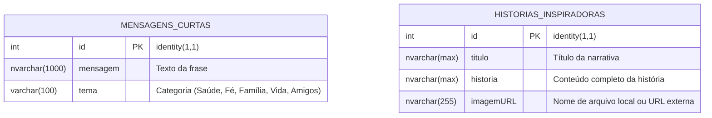
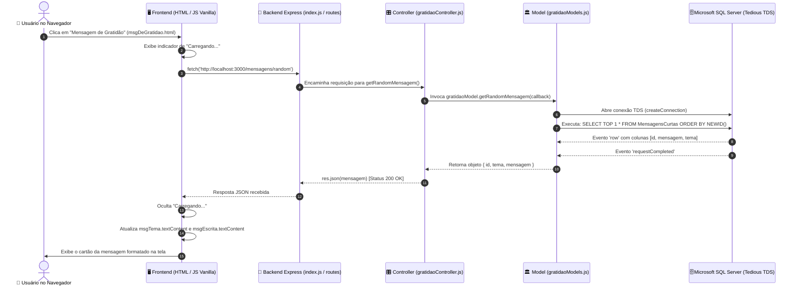

# 🗺️ Arquitetura & Fluxo Completo de Dados

> **Estrutura Full Stack Desacoplada, Padrão MVC e Ciclo de Vida do Projeto Gratidão**

---

## 🏗️ Estrutura de Diretórios do Projeto

O projeto adota uma divisão nítida entre o servidor de aplicação (**Backend**) e a camada de apresentação do usuário (**Frontend**):

```text
projeto-gratidao/
├── Backend/                         # Servidor Node.js + Express + SQL Server
│   ├── controllers/
│   │   └── gratidaoController.js    # Lógica de controle, status HTTP e respostas JSON
│   ├── models/
│   │   └── gratidaoModels.js        # Camada de acesso a dados e queries com driver Tedious
│   ├── routes/
│   │   └── gratidaoRoutes.js        # Declaração dos endpoints RESTful
│   ├── bancodedados.txt             # Script SQL de criação de tabelas, índices e dados iniciais
│   ├── db.js                        # Configuração e pooling da conexão TDS com SQL Server
│   ├── index.js                     # Inicialização do servidor Express (Porta 3000) e CORS
│   ├── package.json                 # Dependências do backend (express, cors, tedious)
│   └── package-lock.json
│
├── Frontend/                        # Aplicação Web Client-Side (HTML5, CSS3, JS Vanilla)
│   ├── Css/                         # Folhas de estilo modularizadas por página
│   │   ├── acaoDeGracas.css
│   │   ├── criaHistDeInspira.css
│   │   ├── gratidao.css
│   │   ├── grupo.css
│   │   ├── histDeInspira.css
│   │   └── msgDeGratidao.css
│   ├── Fonte/                       # Tipografia customizada
│   │   └── Parkinsans-Bold.ttf
│   ├── Html/                        # Páginas de navegação interna
│   │   ├── acaoDeGracas.html        # Página sobre Thanksgiving Day
│   │   ├── criaHistDeInspira.html   # Formulário de criação de histórias
│   │   ├── gratidao.html            # Conceito de gratidão ativa, passiva e teórica
│   │   ├── grupo.html               # Sobre nós e créditos dos estudantes
│   │   ├── histDeInspira.html       # Motor de pesquisa e listagem de histórias
│   │   └── msgDeGratidao.html       # Gerador aleatório e criação de mensagens
│   ├── Imagens/                     # Banco de imagens e fotografias históricas
│   │   ├── BancoDeDados/            # Imagens locais referenciadas pelas histórias (image1 a 15)
│   │   └── ...
│   ├── JavaScript/                  # Scripts assíncronos do frontend
│   │   ├── criaHistDeInspira.js     # POST de novas histórias com validação
│   │   ├── histDeInspira.js         # GET /historias/:palavra com renderização dinâmica
│   │   └── msgDeGratidao.js         # GET aleatório e POST de mensagens
│   ├── index.html                   # Página principal com slider e seletor de idioma
│   ├── script.js                    # Lógica do slider automático e tradução i18n
│   └── style.css                    # Estilização da Home Page
└── README.md
```

---

## 🗄️ Modelo de Dados Relacional (SQL Server)

O banco de dados `acao_de_gracas` estrutura o conhecimento em duas entidades normalizadas:



---

## 🌐 Mapeamento dos Endpoints REST da API

| Método | Rota | Controller / Ação | Parâmetros | Descrição |
| :--- | :--- | :--- | :--- | :--- |
| `GET` | `/mensagens` | `getAllMensagens` | N/A | Retorna todas as frases de gratidão cadastradas |
| `GET` | `/mensagens/random` | `getRandomMensagem` | N/A | Sorteia 1 frase via `ORDER BY NEWID()` no banco |
| `POST` | `/mensagens` | `createMensagens` | Body: `{ tema, mensagem }` | Insere nova frase no banco de dados |
| `GET` | `/historias/:palavra` | `getHistoriaByPalavra` | Params: `:palavra` | Busca relatos que contenham o termo no texto |
| `POST` | `/historia` | `createHistoria` | Body: `{ titulo, historia, imagemURL }` | Cadastra nova história inspiradora |

---

## 🌊 Diagrama Mermaid de Ciclo de Vida e Fluxo de Dados


