# 🏛️ Projeto SENAI X História (Portal Multimídia Interativo de História Moderna)

> **Documentação de Estudo & Engenharia Reversa do Projeto**  
> *Localização original do código-fonte: `/home/desenvolvedores/programa/projeto-historia`*

---

## 📌 Visão Geral do Projeto

O **Projeto SENAI X História** é uma aplicação web interativa desenvolvida em **React 19 + Vite**, concebida a partir de uma proposta interdisciplinar entre a formação técnica em Desenvolvimento de Sistemas (**SENAI**) e a disciplina de História do 3º ano do Ensino Médio (**SESI**), sob orientação dos professores **Antonio Tupinambá**, **Leandro Grosso** e **Julia Milani**.

O objetivo central da aplicação é transformar o estudo de **7 grandes eventos históricos mundiais e nacionais ocorridos entre 1896 e 1930** em uma experiência digital dinâmica, visualmente atrativa e interativa.

### Os 7 Grandes Temas Históricos:
1. 🌵 **Guerra de Canudos** (1896–1897) — O conflito messiânico no sertão baiano liderado por Antônio Conselheiro.
2. 🌲 **Guerra do Contestado** (1912–1916) — A disputa territorial e messiânica no sul do Brasil com os monges João Maria e José Maria.
3. ⚔️ **Primeira Guerra Mundial** (1914–1918) — O conflito global de trincheiras, novas tecnologias bélicas e colapso de impérios.
4. 🔨 **Revolução Russa** (1917) — A queda do czarismo, ascensão dos bolcheviques e fundação da União Soviética.
5. 🦅 **Fascismo Italiano** (1922–1943) — A Marcha sobre Roma, ascensão de Benito Mussolini e totalitarismo europeu.
6. 📉 **Crise de 1929** (A Grande Depressão) — O crash da Bolsa de Nova York e o colapso econômico global.
7. 🎖️ **Revolução de 1930** — O fim da República Velha ("Café com Leite") e a ascensão de Getúlio Vargas ao poder.

Além dos módulos temáticos, o portal integra:
* **Produções Audiovisuais e Gráficas**: Página dedicada com incorporação de vídeo do YouTube e exibição de cartazes temáticos.
* **Consumo Dinâmico da Wikipedia REST API**: Extração em tempo real de artigos e imagens da enciclopédia para enriquecimento dos temas.
* **Sistema de Curtidas & Ranking em Tempo Real**: Votação granular por bloco histórico persistida no cliente.
* **Alternador Global de Tema (Dark/Light Mode)**: Suporte a alto contraste e conforto visual.

---

## 🧭 Metáfora do Mundo Real: *O Museu Interativo com Totens Inteligentes*

Imagine um grande museu histórico onde cada sala é dedicada a um período marcante da história da humanidade.

* **A Navbar Fixa** é o mapa na mão do visitante com um elevador expresso para qualquer ala do museu.
* **As Galerias Temáticas (Pages)** são as salas temáticas decoradas com paletas de cores exclusivas para cada época (verde para o Contestado, laranja para Canudos, vermelho para a Crise de 1929).
* **O Componente `APIWikipedia`** é um *Totem Multimídia* em cada sala: quando o visitante se aproxima, ele consulta a biblioteca central da cidade (Wikipédia) via satélite e projeta na parede o resumo oficial e a fotografia original da época.
* **O `BotaoCurtirTema` e o `Rankings`** são as urnas de votação eletrônica em cada totem: cada visitante pode apertar o coração daquele painel que mais achou interessante. O telão central na recepção (**Página de Rankings**) recalcula instantaneamente os votos e exibe quais períodos históricos foram os mais aclamados.
* **O `BotaoTema`** é o interruptor de iluminação do museu: com um clique, ajusta a luz de todas as salas entre o modo diurno e a exibição noturna com holofotes de foco.

---

## 🛠️ Stack Tecnológica

| Tecnologia | Versão / Tipo | Papel no Ecossistema |
| :--- | :--- | :--- |
| **React** | `^19.1.0` | Biblioteca base declarativa baseada em componentes funcionais e hooks reativos |
| **Vite** | `^6.3.5` | Bundler e servidor de desenvolvimento de última geração com Hot Module Replacement (HMR) |
| **React Router DOM** | `^7.6.0` | Roteamento cliente SPA desacoplado (`BrowserRouter`, `Routes`, `Route`, `Link`) |
| **React Router Hash Link** | `^2.4.3` | Navegação suave por âncoras (`HashLink smooth to="/#conteudos"`) entre rotas distintas |
| **Wikipedia MediaWiki API** | Endpoint REST público | Consumo de dados enciclopédicos dinâmicos (`action=query&prop=pageimages\|extracts`) |
| **LocalStorage API** | Web Storage API (Nativo) | Persistência local do estado de curtidas granulares e preferência de tema escuro/claro |
| **CSS3 Flexbox & Parallax** | Vanilla Moderno | Layouts fluidos, transições de hover, efeitos de fundo fixo (*Parallax scrolling*) e media queries |
| **FontAwesome** | CDN / Classes de Ícones | Iconografia para corações de curtida (`fa-heart`), lua/sol de temas (`fa-moon`, `fa-sun`) |

---

## 📥 Entradas e Saídas do Sistema

```mermaid
flowchart LR
    subgraph ENTRADA["📥 Entradas (Inputs)"]
        E1["Navegação do Usuário (Rotas / Âncoras)"]
        E2["Interação de Curtidas (Cliques em Sections)"]
        E3["Alternância de Tema Claro / Escuro"]
        E4["Parâmetros de Título da Wikipedia (Props)"]
    end

    subgraph PROCESSAMENTO["⚙️ Processamento"]
        P1["React 19 Router DOM (Orquestração de Páginas)"]
        P2["Fetch Assíncrono da Wikipedia REST API"]
        P3["Polling e Sincronização com LocalStorage"]
        P4["Cálculo de Agregação de Votos para Rankings"]
    end

    subgraph SAIDA["📦 Saídas (Outputs)"]
        S1["Interface Renderizada com Paletas Temáticas"]
        S2["Textos e Imagens da Wikipedia Injetados no DOM"]
        S3["Tabela de Rankings Atualizada em Tempo Real"]
        S4["Transição Global de Tema Claro/Escuro no Body"]
    end

    ENTRADA --> PROCESSAMENTO --> SAIDA
```

