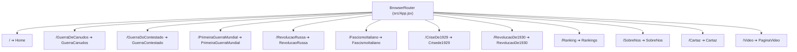
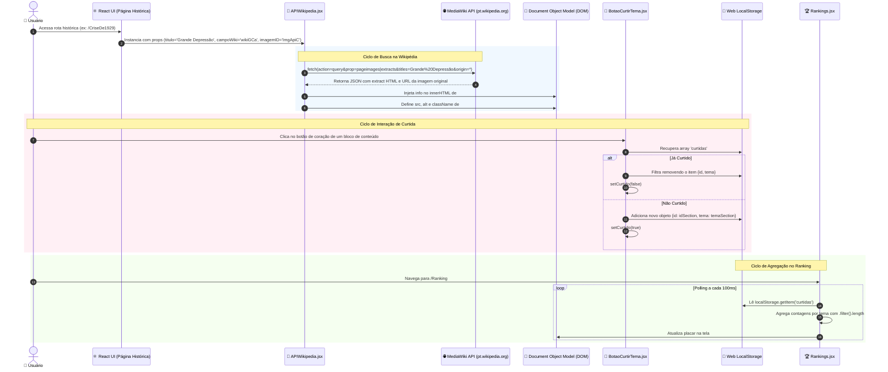

# 🗺️ Arquitetura & Fluxo Completo de Dados

> **Estrutura de Componentes, Roteamento e Ciclo de Vida do Projeto SENAI X História**

---

## 🏗️ Estrutura de Diretórios e Papel dos Componentes

O projeto segue uma arquitetura modular baseada no ecossistema **Vite + React 19**, com separação clara de responsabilidades entre componentes reutilizáveis, páginas temáticas, folhas de estilo CSS independentes e ativos estáticos:

```text
projeto-historia/
├── public/
│   └── logoG3.png                   # Favicon e logo pública
├── src/
│   ├── assets/                      # Imagens históricas organizadas por tema
│   │   ├── Imgs - Revolução de 1930/
│   │   ├── Imgs-Crisede1929/
│   │   ├── Imgs-GuerraCanudos/
│   │   ├── ImgsFooter/
│   │   ├── Logos/
│   │   └── cartaz/
│   ├── components/                  # Componentes de UI e Integração Reutilizáveis
│   │   ├── APIWikipedia.jsx         # Consumidor REST da MediaWiki API
│   │   ├── BotaoCurtirTema.jsx      # Botão de like reativo por section
│   │   ├── BotaoTema.jsx            # Alternador global Dark/Light Mode
│   │   ├── Footer.jsx               # Rodapé expansível em acordeão
│   │   ├── Navbar.jsx               # Cabeçalho com suporte a HashLink
│   │   └── styles/                  # Estilos isolados dos componentes
│   ├── pages/                       # Telas Principais da Aplicação (12 Rotas)
│   │   ├── Cartaz.jsx               # Galeria gráfica de cartazes
│   │   ├── Crisede1929.jsx          # Módulo da Crise de 1929
│   │   ├── FascismoItaliano.jsx     # Módulo do Fascismo Italiano
│   │   ├── GuerraCanudos.jsx        # Módulo de Canudos
│   │   ├── GuerraContestado.jsx     # Módulo do Contestado
│   │   ├── Home.jsx                 # Hub principal com efeito Parallax
│   │   ├── PaginaVideo.jsx          # Player de vídeo da Revolução Russa
│   │   ├── Primeira-Guerra-Mundial.jsx # Módulo da 1ª Guerra
│   │   ├── Rankings.jsx             # Painel em tempo real de curtidas
│   │   ├── RevolucaoDe1930.jsx      # Módulo da Revolução de 1930
│   │   ├── RevolucaoRussa.jsx       # Módulo da Revolução Russa
│   │   ├── SobreNos.jsx             # Informações da equipe e créditos
│   │   └── style/                   # CSS dedicado para cada página
│   ├── App.css
│   ├── App.jsx                      # Configuração do BrowserRouter e Rotas
│   ├── index.css                    # Configuração global de tipografia e body
│   └── main.jsx                     # Ponto de entrada (React 19 createRoot)
├── package.json
└── vite.config.js
```

---

## 🔄 Roteamento do Sistema (React Router DOM v7)

Em [`src/App.jsx`](file:///home/desenvolvedores/programa/projeto-historia/src/App.jsx), a aplicação declara 12 rotas clientes mapeadas para páginas especializadas:



---

## 🌊 Diagrama Mermaid de Ciclo de Vida e Fluxo de Dados



---

## 🎨 Paleta de Cores e Identidade Visual Dinâmica

O projeto implementa uma distinção cromática por evento histórico através de passagem de props para `<Navbar>` e `<Footer>`:

| Página / Tema | Cor Principal | Variantes do Footer / Navbar | Identificador do Header |
| :--- | :--- | :--- | :--- |
| **Home** | Roxo / Branco | `corHeaderFooter="roxo"`, `corInfoFooter="roxoClaro"` | Padrão |
| **Guerra de Canudos** | Laranja Sertão | `corHeaderFooter="laranja"`, `corInfoFooter="laranjaClaro"` | `#navbarGuerraDeCanudos` |
| **Guerra do Contestado** | Verde Floresta | `corHeaderFooter="verde"`, `corInfoFooter="verdeClaro"` | `#navbarGuerraDoContestado` |
| **Primeira Guerra Mundial** | Azul Militar | `corHeaderFooter="azul"`, `corInfoFooter="azulClaro"` | `#navbarPrimeiraGuerraMundial` |
| **Revolução Russa** | Vermelho Soviético | `corHeaderFooter="vermelho"`, `corInfoFooter="vermelhoClaro"` | `#navbarRevolucaoRussa` |
| **Fascismo Italiano** | Verde Escuro | `corHeaderFooter="verde"`, `corInfoFooter="verdeClaro"` | `#navbarFascismoItaliano` |
| **Crise de 1929** | Vermelho Escuro | `corHeaderFooter="vermelhoEscuro"`, `corInfoFooter="vermelhoEscuroClaro"` | `#navbarCriseDe1929` |
| **Revolução de 1930** | Amarelo / Dourado | `corHeaderFooter="amarelo"`, `corInfoFooter="amareloClaro"` | `#navbarRevolucaoDe1930` |
| **Rankings** | Rosa / Salmão | `corHeaderFooter="rosa"`, `corInfoFooter="rosaClaro"` | `#navbarRanking` |
