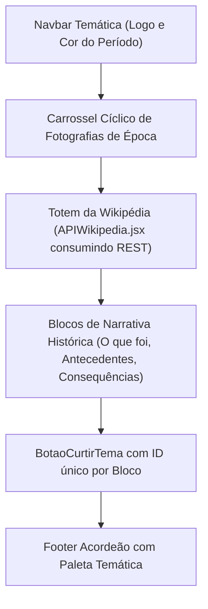

# 🔬 Dissecção Detalhe por Detalhe: Páginas Temáticas & Rankings

> **Análise Aprofundada dos Módulos Históricos, Painel de Rankings e Produções**

---

## 1. 🏠 `Home.jsx` — O Hub Central com Efeito Parallax

* **Localização**: [`src/pages/Home.jsx`](file:///home/desenvolvedores/programa/projeto-historia/src/pages/Home.jsx)
* **Responsabilidade**: Página inicial do portal contendo introdução contextual com efeito de rolagem Parallax, apresentação dos objetivos e grade de navegação para os 7 temas e 2 produções.

### 📝 Estrutura e Destaques Técnicos:

1. **Seções Parallax (`parallax1` e `parallax2`)**:
   No CSS [`src/pages/style/Home.css`](file:///home/desenvolvedores/programa/projeto-historia/src/pages/style/Home.css), a propriedade `background-attachment: fixed` cria o efeito de profundidade visual enquanto o texto rola suavemente por cima das imagens de fundo históricas.
2. **Âncoras de Navegação (`id="conteudos"` e `id="producoes"`)**:
   Servem como ponto de destino para os links `<HashLink smooth to="/#conteudos">` disparados a partir de qualquer outra página da aplicação.
3. **Cards de Navegação Interativa**:
   Cada evento histórico é representado por um card estilizado com imagens de acervos históricos (como Wikimedia Commons e Brasil Escola) e transições em `:hover`.

---

## 2. 🏆 `Rankings.jsx` — Agregação em Tempo Real de Votos

* **Localização**: [`src/pages/Rankings.jsx`](file:///home/desenvolvedores/programa/projeto-historia/src/pages/Rankings.jsx)
* **Responsabilidade**: Consultar o array `curtidas` do `localStorage`, filtrar a quantidade de votos recebidos por cada um dos 7 temas e renderizar o ranking atualizado.

### 📝 Código Integralmente Comentado:

```javascript
import { useEffect, useState } from "react"
import "./style/Rankings.css"
import Navbar from "../components/Navbar"
import Footer from "../components/Footer"
import LogoSiteRosa from "../assets/Logos/LogoSiteRosa.png"
import BotaoTema from "../components/BotaoTema"

function Rankings() {
    // Estado com array bruto de curtidas salvas no cliente
    const [curtidas, setCurtidas] = useState(JSON.parse(localStorage.getItem("curtidas")) || [])
    
    // Contadores individuais para cada um dos 7 eventos históricos
    const [guerraCanudos, setGuerraCanudos] = useState(0)
    const [guerraContestado, setGuerraContestado] = useState(0)
    const [primeiraGuerra, setPrimeiraGuerra] = useState(0)
    const [fascismo, setFascismo] = useState(0)
    const [revolucaoRussa, setRevolucaoRussa] = useState(0)
    const [criseDe1929, setCriseDe1929] = useState(0)
    const [revolucao1930, setRevolucao1930] = useState(0)

    // [L19-L27] Polling em intervalo de 100ms para escutar modificações no localStorage
    useEffect(() => {
        const timer = setInterval(() => {
            setCurtidas(JSON.parse(localStorage.getItem("curtidas")) || [])
        }, 100)

        return () => {
            clearInterval(timer) // Limpeza de memória na desmontagem do componente
        }
    }, [])

    // [L29-L49] Efeito de Agregação e Contagem por Filtro
    useEffect(() => {
        // Filtra os itens correspondentes a cada tema histórico
        const guerraCanudosCurtidas = curtidas.filter(item => item.tema === "Guerra de Canudos")
        const guerraContestadoCurtidas = curtidas.filter(item => item.tema === "Guerra do Contestado")
        const primeiraGuerraCurtidas = curtidas.filter(item => item.tema === "Primeira Guerra Mundial")
        const fascismoCurtidas = curtidas.filter(item => item.tema === "Fascismo Italiano")
        const revolucaoRussaCurtidas = curtidas.filter(item => item.tema === "Revolução Russa")
        const criseDe1929Curtidas = curtidas.filter(item => item.tema === "Crise de 1929")
        const revolucao1930Curtidas = curtidas.filter(item => item.tema === "Revolução de 1930")

        // Atualiza os estados numéricos com o tamanho (.length) de cada array filtrada
        setGuerraCanudos(guerraCanudosCurtidas.length)
        setGuerraContestado(guerraContestadoCurtidas.length)
        setPrimeiraGuerra(primeiraGuerraCurtidas.length)
        setFascismo(fascismoCurtidas.length)
        setRevolucaoRussa(revolucaoRussaCurtidas.length)
        setCriseDe1929(criseDe1929Curtidas.length)
        setRevolucao1930(revolucao1930Curtidas.length)
    }, [curtidas])

    return (
        <>
            <Navbar backgroundId="navbarRanking" logo={LogoSiteRosa} />
            <br />
            <section className="bodyRank">
                <section>
                    <BotaoTema />
                </section>
                <h1>RANKING DAS <span id="rosaRank">CURTIDAS</span> ENTRE <br /> OS CONTEÚDOS</h1>
                <section className="blocoRanks">
                    <p>
                        <span>Guerra de Canudos</span> - {guerraCanudos} curtidas <br />
                        <span>Guerra de Contestado</span> - {guerraContestado} curtidas <br />
                        <span>Primeira Guerra Mundial</span> - {primeiraGuerra} curtidas <br />
                        <span>Revolução Russa</span> - {revolucaoRussa} curtidas <br />
                        <span>Fascismo Italiano</span> - {fascismo} curtidas <br />
                        <span>Crise de 1929</span> - {criseDe1929} curtidas <br />
                        <span>Revolução de 1930</span> - {revolucao1930} curtidas 
                    </p>
                </section>
            </section>
            <Footer corHeaderFooter="rosa" corInfoFooter="rosaClaro" logo={LogoSiteRosa} />
        </>
    )
}

export default Rankings
```

---

## 3. 📜 Padrão Arquitetural das Páginas Históricas (Exemplo: `Crisede1929.jsx`)

As 7 páginas temáticas compartilham uma estrutura consistente de 4 camadas:



### Elementos-Chave em Cada Bloco de Conteúdo:
* **Identificador de Bloco para Curtidas Granulares**: Cada bloco possui um `<BotaoCurtir idSection="Bloco1Crise" tema="Crise de 1929" />` ou `<BotaoCurtir idSection="Bloco2Crise" tema="Crise de 1929" />`. Isso permite ao usuário curtir partes específicas da matéria (ex: gostar da seção "Bolsa de Valores" e não curtir "Antecedentes"), somando votos no ranking macro do tema.
* **Consumo Dinâmico**: O componente `<APIWikipedia titulo="Grande Depressão" campoWiki="wikiGCa" imagemID="ImgApiC" />` busca automaticamente os dados da enciclopédia e preenche a área reservada sem travar a renderização inicial.

---

## 4. 🎨 Módulos de Produções e Créditos

### 🖼️ `Cartaz.jsx`
* Renderiza a galeria visual com as produções gráficas elaboradas pelos estudantes para as exposições escolares (`fotoCartaz1.jpeg` e `fotoCartaz2.jpeg`).
* Explica a importância pedagógica do cartaz como elemento de síntese e comunicação visual na transmissão de fatos históricos.

### 🎬 `PaginaVideo.jsx`
* Incorpora um player responsivo do YouTube via `<iframe>` (`https://www.youtube.com/embed/hZxt6tVbQds?si=cMGTXEEwaiNr_k26&start=272`), permitindo que a videoaula produzida pelo grupo sobre a Revolução Russa seja assistida diretamente dentro do portal.

### 👥 `SobreNos.jsx`
* Apresenta a fotografia oficial do **Grupo 3**, créditos aos 6 integrantes da equipe e descrição da proposta interdisciplinar entre a formação técnica do SENAI e o currículo de Ciências Humanas do SESI.
